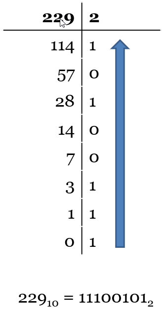

# Estructuras de repetición
## Ejercicio: Convertir a binario


## Instrucciones
- Elabora el análisis y el algoritmo ***antes de escribir el código***. Utiliza un diagrama de flujo para representar tu algoritmo e ilustrar su lógica.

- **Diseña un programa para convertir un número base 10 a binario** usando el procedimiento descrito más abajo.

- Codifica tu solución en el archivo [`convertir_a_binario.py`](/convertir_a_binario.py).
   
- Utiliza los siguientes ejemplos para dar formato a tus entradas y salidas:
  ```
  Introduzca un número: 12
  El número 12 en binario es 1100
  
  Introduzca un número: 123
  El número 123 en binario es 1111011
  ```
  
- Prueba tu programa corriéndolo varias veces con diferentes entradas. Verifica que tu algoritmo produzca las salidas correctas. Pon atención especial a los casos que pudieran ser problemáticos de manejar (casos límite).

- Añade su respectiva cadena de documentación (*docstring*) al inicio de tu programa:
  
## Procedimiento para convertir un número en binario
|Resolver el ejercicio usando el siguiente algoritmo||
|:------------------------------|---|
|<ul><li>Dividir el número decimal entre 2</li><li>Anotar el cociente abajo del número y el residuo a la derecha del cociente</li><li>Repetir la operación usando el cociente como nuevo dividendo</li><li>Continuar hasta obtener un cociente de 0</li><li>Tomar los residuos, desde el último al primero (de abajo para arriba), para formar el número binario</li></ul>||


## Entrega
Completa este y el resto de los ejercicios y compila, para cada ejercicio, el enunciado, análisis, diagrama de flujo, código y pruebas de ejecución, en un informe tal como se describe en los requisitos para entrega de tareas en Canvas. No olvides incluir portada y conclusiones.

## Casos de prueba de ejemplo
| Entradas | Salidas |
|:---------|:--------|
| `12` | `El número 12 en binario es 1100` |
| `123` | `El número 123 en binario es 1111011` |

## Rúbrica
Verifica tu entrega contra la rúbrica disponible en Canvas para maximizar tu calificación.